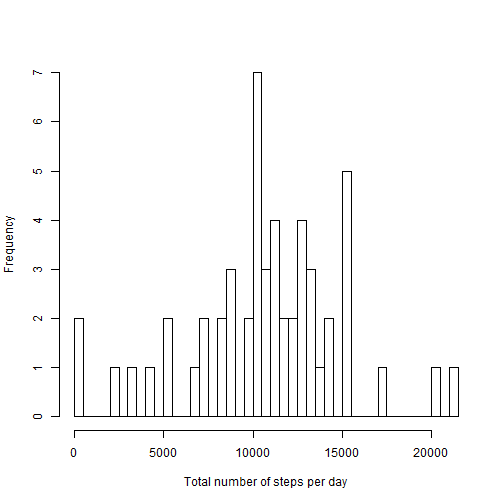
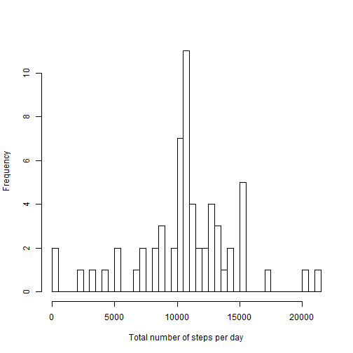
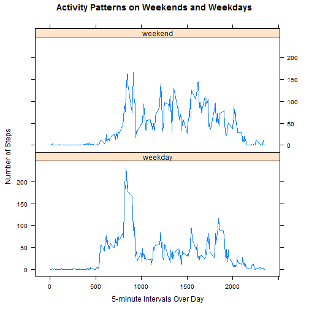

# Reproducible Research: Peer Assessment 1


## Loading and preprocessing the data


```r
unzip("activity.zip")
activity<-read.csv("activity.csv",stringsAsFactor=FALSE,header=TRUE)
activity$date <- as.Date(activity$date, "%Y-%m-%d")
head(activity)
```

```
##   steps       date interval
## 1    NA 2012-10-01        0
## 2    NA 2012-10-01        5
## 3    NA 2012-10-01       10
## 4    NA 2012-10-01       15
## 5    NA 2012-10-01       20
## 6    NA 2012-10-01       25
```

## What is mean total number of steps taken per day?

**Calculate Steps Per Day.**

```r
stepsPerDate<-aggregate(steps ~ date, data = activity, FUN = sum)
head(stepsPerDate)
```

```
##         date steps
## 1 2012-10-02   126
## 2 2012-10-03 11352
## 3 2012-10-04 12116
## 4 2012-10-05 13294
## 5 2012-10-06 15420
## 6 2012-10-07 11015
```

**Make a plot of the total number of steps taken each day.**

```r
hist(stepsPerDate$steps,
     main="",
     xlab="Total number of steps per day",
     breaks=nrow(stepsPerDate))
```

 

**Calculate and report the mean of steps taken per day.**

```r
stepsPerDateMean<-mean(stepsPerDate$steps)
stepsPerDateMean
```

```
## [1] 10766
```

**Calculate and report the median total number of steps taken per day.**

```r
stepsPerDateMedian<-median(stepsPerDate$steps)
stepsPerDateMedian
```

```
## [1] 10765
```

## What is the average daily activity pattern?

**Make a time series plot of the 5-minute interval (x-axis) and the average number of steps taken, averaged across all days (y-axis).**

```r
steps_interval <- aggregate(steps ~ interval, data = activity, FUN = mean)
head(steps_interval)
```

```
##   interval   steps
## 1        0 1.71698
## 2        5 0.33962
## 3       10 0.13208
## 4       15 0.15094
## 5       20 0.07547
## 6       25 2.09434
```

```r
plot(steps_interval, type = "l")
```

 

**Which 5-minute interval, on average across all the days in the dataset, contains the maximum number of steps?**

```r
steps_interval[steps_interval$steps==max(steps_interval$steps),"interval"]
```

```
## [1] 835
```

## Imputing missing values

**Calculate and report the total number of missing values in the dataset.**

```r
sum(is.na(activity$steps))
```

```
## [1] 2304
```

**Devise a strategy for filling in all of the missing values in the dataset. The strategy does not need to be sophisticated.**

My strategy for filling in NAs in the dataset is to replace them with the integet of the mean for that specific interval.

**Create a new dataset that is equal to the original dataset but with the missing data filled in.**

```r
activityNew<-activity
activityNew$steps<-ifelse(
    is.na(activityNew$steps) & activityNew$interval==steps_interval$interval,
    as.integer(steps_interval$steps),
    activityNew$steps)
```

**Make a histogram of the total number of steps taken each day**

```r
stepsPerDateNew<-aggregate(steps ~ date, data = activityNew, FUN = sum)
hist(stepsPerDateNew$steps,
     main="",
     xlab="Total number of steps per day",
     breaks=nrow(stepsPerDateNew))
```

 

**Calculate and report the mean of steps taken per day.**

```r
stepsPerDateNewMean<-mean(stepsPerDateNew$steps)
stepsPerDateNewMean
```

```
## [1] 10750
```

**Calculate and report the median total number of steps taken per day.**

```r
stepsPerDateNewMedian<-median(stepsPerDateNew$steps)
stepsPerDateNewMedian
```

```
## [1] 10641
```

**Do these values differ from the estimates from the first part of the assignment? What is the impact of imputing missing data on the estimates of the total daily number of steps?**

Yes the values differ. The new dataset has slightly lower values for the mean and median of the total number of steps taken per day.

## Are there differences in activity patterns between weekdays and weekends?

**Create a new factor variable in the dataset with two levels – “weekday” and “weekend” indicating whether a given date is a weekday or weekend day.**

```r
weekend<-c("Saturday","Sunday")
activityNew$DayType<-as.factor(
    ifelse(weekdays(activityNew$date) %in% weekend,"weekend","weekday"))
```

**Make a panel plot containing a time series plot of the 5-minute interval (x-axis) and the average number of steps taken, averaged across all weekday days or weekend days (y-axis).**

```r
library(plyr)
library(lattice)
stepsPerDayType <- ddply(activityNew, .(interval, DayType), summarize, steps = mean(steps))
xyplot(steps~interval | DayType,
       data=stepsPerDayType,
       layout=c(1,2),
       type="l",
       xlab="5-minute Intervals Over Day",
       ylab="Number of Steps",
       main="Activity Patterns on Weekends and Weekdays")
```

 
